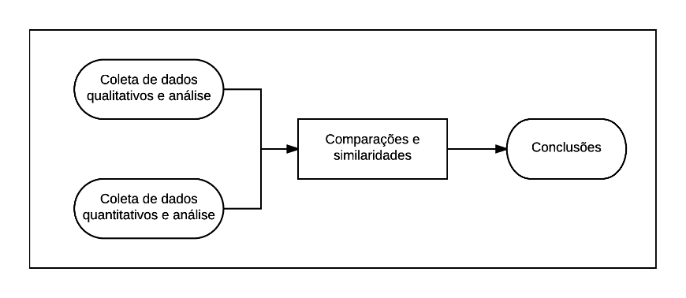
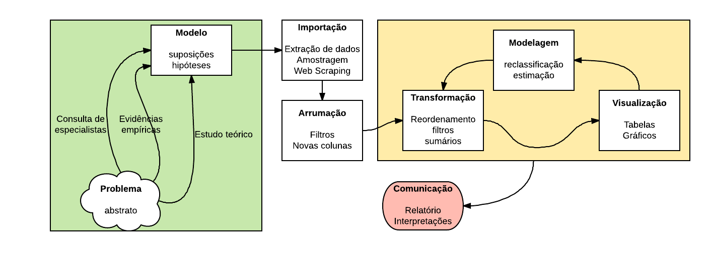

# Metodologia

```{r knit, echo=FALSE}
knitr::opts_chunk$set(echo = FALSE, warning = FALSE, message = FALSE,
                      fig.width = 9, fig.height = 4)
```

```{r}
library(tidyverse)
library(lubridate)
library(stringr)
library(forcats)
library(glue)
theme_cnj <- function() {
  theme_bw(14)
}
fmt <- function(x) {
  format(x, big.mark = '.', small.mark = ',',
         decimal.mark = ',',
         scientific = FALSE, trim = TRUE)
}
fmt_p <- function(x) {
  if (length(x) == 0) return(character())
    x <- plyr::round_any(x, scales:::precision(x) / 100)
    x <- fmt(x * 100)
    paste0(x, "%")
}
fct_lump2 <- function(f, reps) {
  ord <- order(reps)
  v <- rep(f, ord)
  inds <- cumsum(ord)
  forcats::fct_lump(v, n = 10, other_level = 'Outros')[inds]
}
```

Nesse capítulo, descrevemos a metodologia utilizada para solucionar os problemas de cada parte. Na introdução vimos que a pesquisa apresenta uma parte *exploratória* e uma parte *propositiva*. A primeira envolve o levantamento dos maiores litigantes em ações consumeristas e a segunda envolve propor soluções para lidar com o estoque de processos atual e evitar novos casos.

A pesquisa tem base filosófica pragmática [@hanson2005mixed]. Isso significa que o foco principal são resultados aplicáveis na sociedade. O rigor metodológico reside principalmente na parte exploratória, especificamente nos métodos estatísticos de análise e inferência.

A pesquisa também busca atender o *princípio da reprodutibilidade* [@gelman2014bayesian]. Com isso será possível utilizar o material desenvolvido em outros trabalhos, produzindo um efeito maior do que apenas a documentação de resultados.

A metodologia do estudo possui um desenho misto (@hanson2005mixed, p. 116). Especificamente, utilizamos a técnica de métodos convergentes em paralelo (*convergent parallel methods design*). Nessa abordagem, coletamos e analisamos dados qualitativos e quantitativos em paralelo, confrontando os resultados para gerar interpretações e conclusões. A Figura \@ref(fig:desenho) mostra esquematicamente o desenho utilizado.

<!-- ```{r desenho, fig.cap="Método misto em paralelo convergente (adaptado de [@creswell2013research], p. 270)."} -->
<!--  -->
<!-- ``` -->

![Método misto em paralelo convergente (adaptado de [@creswell2013research], p. 270).](imgs/creswell.png){#fig:desenho}

A parte exploratória utiliza métodos quantitativos baseados em dados
observacionais para elucidar o fenômeno de interesse (@hanson2005mixed, p. 18). Nesse caso, iniciamos com a obtenção de dados para posterior análise e interpretação de resultados. A Figura \@ref(fig:quanti) mostra essa parte de forma esquemática.

<!-- ```{r quanti, fig.cap="Metodologia quantitativa. Adaptado de @wickham2016r."} -->
<!--  -->
<!-- ``` -->

{#fig:quanti}


Já a parte propositiva utiliza tanto métodos quantitativos não-experimentais quanto métodos qualitativos para gerar as proposições. Nesse caso, fizemos entrevistas, levantamentos bibliográficos e levantamento de dados para suportar as argumentações.

A convergência das duas partes da pesquisa se deu na forma usual, a partir do confrontamento dos resultados levantados (@creswell2013research, p.118). Os resultados da parte exploratória são utilizados como *inputs* para tomadas de decisão na parte propositiva, com o intuito de i) descartar parte das proposições ou ii) indicar formas de execução das propostas focadas em grupos estratégicos identificados na parte exploratória (e.g. regiões ou tipos empresariais).

A seguir, descrevemos a metodologia em maior detalhe. A Seção \@ref(parte-exploratoria) contempla os métodos de obtenção e análise dos dados. A Seção \ref(@parte-propositiva) descreve as atividades realizadas da parte propositiva.

## Parte exploratória {#parte-exploratoria}

Nessa parte da metodologia, utilizamos dados e informações de outras pesquisas para resolver algumas questões de escopo e direcionamento da pesquisa. Especificamente, trabalhamos i) a direção da pesquisa; ii) a situação atual; iii) a execução dos trabalhos; iv) a validação dos resultados.

Os resultados dessas investigações foram resumidos abaixo. Em seguida, apresentamos uma subseção de detalhamento para cada item.

1. A direção da pesquisa é a busca de soluções para melhorar índices de litigiosidade.
1. a) Identificamos que processos não-criminais e não-fiscais do primeiro grau na Justiça Estadual e as execuções fiscais são os maiores responsáveis pelo volume processual do país; b) não é possível avançar na identificação dos maiores responsáveis pela litigiosidade sem realizar extrações de processos dos tribunais.
1. a) Definição do recorte da pesquisa; b) extração de dados dos tribunais; c) criação de método para contagem de processos consumeristas; d) desenvolvimento de códigos para arrumar os nomes das partes dos processos.
1. Utilização do IADN - Índice de Atendimento à Demanda Normalizado para avaliar o efeito de soluções estratégicas.

### Direção da pesquisa {#direcao-da-pesquisa}

O tema de interesse da pesquisa é a **administração judiciária**. Especificamente, queremos propor soluções estratégicas para **melhorar os índices de litigiosidade**. As direções de intervenção e os índices de interesse são:

1. Reduzir a quantidade de casos novos e pendentes.
1. Reduzir a taxa de congestionamento.
1. Aumentar o índice de atendimento à demanda.
1. Monitorar a recorribilidade externa do primeiro grau.
1. Monitorar o índice de conciliação.

Não há interesse em estudar a quantidade de casos novos por magistrado ou servidor. As contagens de magistrados e servidores foram fixadas para simplificar a análise. Também por simplicidade não monitoramos recorribilidade interna.

O índice de conciliação, por sua vez, está correlacionado a outros índices de interesse. Na pesquisa, não foi possível obter evidências para afirmar se há interesse em aumentar, reduzir ou manter os valores atuais dessa métrica.

As ações estratégicas focaram nos maiores litigantes em casos consumeristas pois soluções para essa subpopulação implicam em efeitos significativos para toda a Justiça Brasiliera. Essa afirmação foi feita inicialmente sob a hipótese de que casos consumeristas representam uma quantidade relevante do total de casos. Essa hipótese foi validada após extração e levantamento dos dados.

### Resumo da situação atual {#resumo-da-situacao-atual}

Começamos o estudo com um levantamento baseado no Relatório Justiça em Números 2016 (RJN), que utiliza dados enviados pelos tribunais referentes ao ano de 2015. A presente análise tem como objetivo dar uma visão geral do que estamos enfrentando e quais são os passos.

O estudo preliminar considerou somente as métricas de litigiosidade do RJN: os casos novos, os casos pendentes e a quantidade de processos baixados. Os casos pendentes refletem a situação atual do judiciário; os casos novos relacionam-se com a demanda futura e os processos baixados referem-se à eficácia.

```{r dados}
dados <- rjn::d_jn$dados[["JN_18-Out-2016.csv"]]
```

A Tabela \@ref(tab:jntot) mostra a quantidade de casos novos e pendentes por ramo da Justiça. É possível observar que a Justiça Estadual foi responsável por quase 70% dos casos novos e quase 80% dos casos pendentes. Isso mostra que, para fins de administração do judiciário, faz sentido considerar a Justiça Estadual como foco principal.

```{r tab:jntot, results='asis'}
dados %>%
  filter(ano == 2015, str_detect(dsc_tribunal, '^Just|Super')) %>%
  mutate_at(vars(cn, cp), funs(as.numeric)) %>%
  select(dsc_tribunal, cn, cp) %>%
  mutate(dsc_tribunal = fct_other(dsc_tribunal,
                                  keep = c('Justiça Estadual',
                                           'Justiça do Trabalho',
                                           'Justiça Federal'),
                                  other_level = 'Outros')) %>%
  group_by(dsc_tribunal) %>%
  summarise(total_n = sum(cn), total_p = sum(cp)) %>%
  arrange(desc(total_n)) %>%
  janitor::adorn_totals("row") %>%
  mutate(prop_n = total_n / sum(total_n) * 2,
         prop_p = total_p / sum(total_p) * 2) %>%
  transmute(
    Justiça = dsc_tribunal,
    `Casos Novos` = sprintf("%s (%s)", fmt(total_n), fmt_p(prop_n)),
    `Casos Pendentes` = sprintf("%s (%s)", fmt(total_p), fmt_p(prop_p))
  ) %>%
  include_table(align = 'llrr', caption = "Casos novos e casos pendentes por Justiça.")
```

A Tabela \ref(tab:inst) mostra o volume de casos novos e pendentes dentro da Justiça Estadual, por instância. Observe que o volume de casos pendentes no primeiro grau, somado ao volume nos Juizados Especiais, representam mais de 96% do total. Logo, um segundo filtro adequado é o da instância.

```{r tab:nst}
dados %>%
  filter(justica == 'Estadual', sigla != 'TJ') %>%
  select(sigla, ano, cn1, cn2, cp1, cp2, cnje, cntr, cpje, cptr) %>%
  mutate_at(vars(-sigla), funs(as.numeric)) %>%
  group_by(sigla) %>%
  # mutate_all(funs(if_else(is.na(.), round(mean(., na.rm = TRUE)), .))) %>%
  mutate_all(funs(if_else(is.na(.), 0, .))) %>%
  ungroup() %>%
  filter(ano == 2015) %>%
  select(-sigla, -ano) %>%
  summarise_all(sum) %>%
  gather() %>%
  separate(key, c('tipo', 'inst'), sep = 2) %>%
  mutate(tipo = case_when(
    tipo == 'cn' ~ 'total_n',
    tipo == 'cp' ~ 'total_p'
  )) %>%
  mutate(inst = case_when(
    inst == '1' ~ 'Primeiro Grau',
    inst == '2' ~ 'Segundo Grau',
    inst == 'je' ~ 'Juizados Especiais',
    inst == 'tr' ~ 'Turmas Recursais'
  )) %>%
  spread(tipo, value) %>%
  arrange(desc(total_p)) %>%
  janitor::adorn_totals("row") %>%
  mutate(prop_n = total_n / sum(total_n) * 2,
         prop_p = total_p / sum(total_p) * 2) %>%
  transmute(
    `Grau` = inst,
    `Casos Novos` = sprintf("%s (%s)", fmt(total_n), fmt_p(prop_n)),
    `Casos Pendentes` = sprintf("%s (%s)", fmt(total_p), fmt_p(prop_p))
  ) %>%
  include_table(align = 'llrr', caption = "Casos novos e casos pendentes por grau. TJAM não enviou dados da segunda instância no ano de 2015. Nesse caso, consideramos esse valor como zero.")
```

O terceiro filtro aplicado relaciona-se com as áreas processuais criminal e não criminal. A Tabela \ref(tab:crim) mostra a quantidade de casos novos e pendentes no primeiro grau e nos Juizados especiais, comparando as duas áreas. A área não criminal é responsável por 88% dos casos pendentes. Mesmo com todos os filtros aplicados, ainda estamos com uma subpopulação de mais de 50 milhões de casos pendentes.

```{r tab:crim}
dados %>%
  filter(justica == 'Estadual', sigla != 'TJ') %>%
  select(
    sigla, ano,
    # casos pendentes
    ## nao criminais
    cpcncrim1, cpcncrimje,
    cpext1, exejudpncrim1, cpextje, exejudpncrimje,
    ## criminais
    cpccrim1, cpccrimje,
    exejudpcrimpl1, exejudpcrimnpl1, exejudpcrimnplje,
    # casos novos
    ## nao criminais
    cncncrim1, cncncrimje,
    cnext1, exejudncrim1, cnextje, exejudncrimje,
    ## criminais
    cnccrim1, cnccrimje,
    exejudcrimpl1, exejudcrimnpl1, exejudcrimnplje
  ) %>%
  mutate_at(vars(-sigla), funs(as.numeric)) %>%
  group_by(sigla) %>%
  # mutate_all(funs(if_else(is.na(.), round(mean(., na.rm = TRUE)), .))) %>%
  mutate_all(funs(if_else(is.na(.), 0, .))) %>%
  ungroup() %>%
  filter(ano == 2015) %>%
  select(-sigla, -ano) %>%
  summarise_all(sum) %>%
  mutate(
    cpcrim = cpccrim1 + cpccrimje +
      exejudpcrimpl1 + exejudpcrimnpl1 + exejudpcrimnplje,
    cncrim = cnccrim1 + cnccrimje +
      exejudcrimpl1 + exejudcrimnpl1 + exejudcrimnplje,
    cpncrim = cpcncrim1 + cpcncrimje +
      cpext1 + exejudpncrim1 + cpextje + exejudpncrimje,
    cnncrim = cncncrim1 + cncncrimje +
      cnext1 + exejudncrim1 + cnextje + exejudncrimje
  ) %>%
  select(cpcrim, cncrim, cpncrim, cnncrim) %>%
  gather() %>%
  separate(key, c('tipo', 'inst'), sep = 2) %>%
  mutate(tipo = case_when(
    tipo == 'cn' ~ 'total_n',
    tipo == 'cp' ~ 'total_p'
  )) %>%
  mutate(inst = case_when(
    inst == 'ncrim' ~ 'Não criminal',
    inst == 'crim' ~ 'Criminal'
  )) %>%
  spread(tipo, value) %>%
  arrange(desc(total_p)) %>%
  janitor::adorn_totals("row") %>%
  mutate(prop_n = total_n / sum(total_n) * 2,
         prop_p = total_p / sum(total_p) * 2) %>%
  transmute(
    `Área` = inst,
    `Casos Novos` = sprintf("%s (%s)", fmt(total_n), fmt_p(prop_n)),
    `Casos Pendentes` = sprintf("%s (%s)", fmt(total_p), fmt_p(prop_p))
  ) %>%
  include_table(align = 'llrr', caption = "Casos novos e casos pendentes por área, dentro do primeiro grau ou Juizado Especial. TJPI não enviou alguns dados de Juizados Especiais no ano de 2015. Nesse caso, consideramos esse valor como zero.")
```

O próximo filtro é baseado no problema da execução fiscal. Para fins de administração dos tribunais, existem dois tipos de processos principais: execução fiscal e outros. Esses casos são muito relevantes em volume processual, especialmente na Justiça Estadual.

A Tabela \@ref(tab:fiscal) mostra a quantidade de casos novos e pendentes não criminais no primeiro grau e nos Juizados especiais, comparando execuções fiscais com todo o resto. Metade dos casos pendentes são de execução fiscal, enquanto que somente 16\% dos casos novos são de execução fiscal. Isso indica que, além de volumosos, os casos de execução fiscal apresentam alta taxa de congestionamento. Uma análise mais aprofundada do tema foi descrita no Relatório Justiça em Números.

Nesse momento foi feita uma importante decisão de escopo: estudar apenas os casos não criminais e não relacionados à execução fiscal. Agora, nossa população de casos pendentes tem aproximadamente 25 milhões de processos.

```{r tab:fiscal}
dados %>%
  filter(justica == 'Estadual', sigla != 'TJ') %>%
  select(
    sigla, ano,
    # casos pendentes
    ## nao criminais
    cpcncrim1, cpcncrimje,
    cpextfisc1, cpextnfisc1, exejudpncrim1, cpextje, exejudpncrimje,
    ## criminais
    cpccrim1, cpccrimje,
    exejudpcrimpl1, exejudpcrimnpl1, exejudpcrimnplje,
    # casos novos
    ## nao criminais
    cncncrim1, cncncrimje,
    cnextfisc1, cnextnfisc1, exejudncrim1, cnextje, exejudncrimje,
    ## criminais
    cnccrim1, cnccrimje,
    exejudcrimpl1, exejudcrimnpl1, exejudcrimnplje
  ) %>%
  mutate_at(vars(-sigla), funs(as.numeric)) %>%
  group_by(sigla) %>%
  # mutate_all(funs(if_else(is.na(.), round(mean(., na.rm = TRUE)), .))) %>%
  mutate_all(funs(if_else(is.na(.), 0, .))) %>%
  ungroup() %>%
  filter(ano == 2015) %>%
  select(-sigla, -ano) %>%
  summarise_all(sum) %>%
  transmute(
    cpfisc = cpextfisc1,
    cnfisc = cnextfisc1,
    cpjud = cpextnfisc1 + exejudpncrim1 + cpextje + exejudpncrimje,
    cnjud = cnextnfisc1 + exejudncrim1 + cnextje + exejudncrimje,
    cpcon = cpcncrim1 + cpcncrimje,
    cncon = cncncrim1 + cncncrimje
  ) %>%
  gather() %>%
  separate(key, c('tipo', 'inst'), sep = 2) %>%
  mutate(tipo = case_when(
    tipo == 'cn' ~ 'total_n',
    tipo == 'cp' ~ 'total_p'
  )) %>%
  mutate(inst = case_when(
    inst == 'con' ~ 'Conhecimento',
    inst == 'jud' ~ 'Execução judicial ou extrajudicial não fiscal',
    inst == 'fisc' ~ 'Execução fiscal'
  )) %>%
  spread(tipo, value) %>%
  arrange(desc(total_p)) %>%
  janitor::adorn_totals("row") %>%
  mutate(prop_n = total_n / sum(total_n) * 2,
         prop_p = total_p / sum(total_p) * 2) %>%
  transmute(
    `Tipo de processo` = inst,
    `Casos Novos` = sprintf("%s (%s)", fmt(total_n), fmt_p(prop_n)),
    `Casos Pendentes` = sprintf("%s (%s)", fmt(total_p), fmt_p(prop_p))
  ) %>%
  knitr::kable(align = 'lrr', caption = "Casos novos e casos pendentes não criminais por tipo de processo, dentro do primeiro grau ou Juizado Especial. TJPI não enviou alguns dados de Juizados Especiais no ano de 2015. Nesse caso, consideramos esse valor como zero.")
```

Nesse cenário, surgem as perguntas:

1. Qual o perfil dos casos pendentes?
1. Que estratégias podem ser adotadas para encerrar esses casos?
1. Como evitar a entrada de casos desnecessários dentro dos quase 10 milhões anuais?

Para investigar as dúvidas de forma efetiva, seria necessário estudar os assuntos dos processos e as partes envolvidas. Infelizmente até hoje não existem bases públicas com esses dados e, por isso, consideramos novos filtros. Como tais filtros envolvem extração e arrumação de dados, é necessário definir uma estratégia adequada para sua obtenção. Em seguida, descrevemos em detalhes a estratégia adotada na presente pesquisa.

### Execução dos trabalhos {#execucao-dos-trabalhos}

O próximo filtro aplicado considera algumas UFs de interesse. Esse filtro não está relacionado com a população-alvo da pesquisa, pois as conclusões e propostas devem ser aplicáveis a todos os tribunais estaduais. No entanto, um corte no escopo foi feito para garantir que a pesquisa seria exequível.

Outro detalhe importante é que o corte regional não foi pensado unicamente pelo volume processual. Nesse caso, consideramos também a necessidade de incluir pelo menos uma UF por região brasilera, além de considerar tribunais de todos os portes.

A escolha dos Tribunais Estaduais foi baseada em três critérios: i) a abrangência geográfica; ii) a necessidade de escolha de dois Tribunais de cada porte; e iii) a possibilidade de contemplar UFs responsáveis por considerável proporção dos litígios em cada região.

Para proporcionar um estudo adequado, foi necessário incluir sete Unidades Federativas para execução da pesquisa: São Paulo, Rio de Janeiro, Rio Grande do Sul, Bahia, Distrito Federal, Mato Grosso do Sul e Amazonas. Isso aconteceu pois, como existem cinco regiões e um mínimo de seis Unidades Federativas para avaliação, tem-se somente um grau de liberdade para escolha de UFs. No entanto, é de extrema importância considerar o Tribunal do Distrito Federal e Territórios como parte do estudo, pelas suas peculiaridades, além de um outro Tribunal da região Centro-oeste. Por outro lado, é sabido que a região Sudeste é responsável por grande parte dos litígios em ações consumeristas, e seria ruim considerar apenas uma UF nesta região. Por isso, foi necessário considerar o TJDFT e dois tribunais do Sudeste, além de um Tribunal para cada região do Brasil.

Durante a primeira fase do projeto, produzimos um ofício com pedidos de listagens de processos, contendo diversas variáveis e especificações. Os resultados das extrações foram descritos em subseções próprias. No final, acabamos considerando o TJMT no lugar do TJMS por conta da disponibilidade dos dados. Dessa forma, a pesquisa ficou com um tribunal de pequeno porte, três de médio porte e três de grande porte.

A Tabela \@ref(tab:tabuf) mostra a quantidade de casos novos e pendentes não criminais de conhecimento no primeiro grau para cada Tribunal escolhido. Já a Figura \@ref(fig:tempo) mostra o volume de casos novos e pendentes ao longo dos anos. Observa-se que as quantidades não são estáveis, mesmo considerando Tribunais de grande porte.

```{r tab:tabuf}
data(cadmun, package = 'abjData')
cadmun <- distinct(cadmun, uf, regiao)
dados %>%
  filter(justica == 'Estadual', sigla != 'TJ') %>%
  mutate(uf = str_sub(sigla, 3, 4)) %>%
  inner_join(cadmun, 'uf') %>%
  select(
    sigla, ano, regiao, porte,
    # casos pendentes
    ## nao criminais
    cpcncrim1, cpcncrimje,
    cpextfisc1, cpextnfisc1, exejudpncrim1, cpextje, exejudpncrimje,
    # casos novos
    ## nao criminais
    cncncrim1, cncncrimje,
    cnextfisc1, cnextnfisc1, exejudncrim1, cnextje, exejudncrimje
  ) %>%
  mutate_at(vars(-sigla, -regiao, -porte), funs(as.numeric)) %>%
  group_by(sigla) %>%
  # mutate_all(funs(if_else(is.na(.), round(mean(., na.rm = TRUE)), .))) %>%
  mutate_if(is.numeric, funs(if_else(is.na(.), 0, .))) %>%
  ungroup() %>%
  filter(ano == 2015) %>%
  select(-ano) %>%
  transmute(
    inst = sigla,
    regiao = regiao,
    porte = porte,
    total_p = cpcncrim1 + cpcncrimje +
      cpextnfisc1 + exejudpncrim1 + cpextje + exejudpncrimje,
    total_n = cncncrim1 + cncncrimje +
      cnextnfisc1 + exejudncrim1 + cnextje+ exejudncrimje
  ) %>%
  arrange(desc(total_p)) %>%
  unite(janitor, inst, regiao, porte) %>%
  janitor::adorn_totals("row") %>%
  separate(janitor, c('inst', 'regiao', 'porte'), sep = '_') %>%
  mutate(soma_n = sum(total_n) / 2, soma_p = sum(total_p) / 2) %>%
  mutate(prop_n = total_n / soma_n,
         prop_p = total_p / soma_p) %>%
  filter(inst %in% c('TJSP', 'TJMT', 'TJRS', 'TJRJ', 'TJDFT',
                     'TJAM', 'TJBA')) %>%
  unite(janitor, inst, regiao, porte) %>%
  janitor::adorn_totals("row") %>%
  separate(janitor, c('inst', 'regiao', 'porte'), sep = '_') %>%
  transmute(
    `Tribunal` = inst,
    `Região` = regiao,
    `Porte` = porte,
    `Casos Novos` = sprintf("%s (%s)", fmt(total_n), fmt_p(prop_n)),
    `Casos Pendentes` = sprintf("%s (%s)", fmt(total_p), fmt_p(prop_p))
  ) %>%
  include_table(align = 'llllrr',
               caption = "Casos novos e casos pendentes cíveis por tribunal. Os porcentuais foram calculados em relação ao total de casos considerando todos os Tribunais.")
```

```{r tempo, fig.height=5, fig.cap="Volume de casos novos e pendentes ao longo do tempo nos tribunais de interesse."}
data(cadmun, package = 'abjData')
cadmun <- distinct(cadmun, uf, regiao)
dados %>%
  filter(justica == 'Estadual', sigla != 'TJ') %>%
  mutate(uf = str_sub(sigla, 3, 4)) %>%
  inner_join(cadmun, 'uf') %>%
  select(
    sigla, ano, regiao, porte,
    # casos pendentes
    ## nao criminais
    cpcncrim1, cpcncrimje,
    cpextfisc1, cpextnfisc1, exejudpncrim1, cpextje, exejudpncrimje,
    # casos novos
    ## nao criminais
    cncncrim1, cncncrimje,
    cnextfisc1, cnextnfisc1, exejudncrim1, cnextje, exejudncrimje
  ) %>%
  mutate_at(vars(-sigla, -regiao, -porte), funs(as.numeric)) %>%
  group_by(sigla) %>%
  # mutate_all(funs(if_else(is.na(.), round(mean(., na.rm = TRUE)), .))) %>%
  mutate_if(is.numeric, funs(if_else(is.na(.), 0, .))) %>%
  ungroup() %>%
  transmute(
    inst = sigla,
    regiao = regiao,
    ano = ano,
    porte = porte,
    total_p = cpcncrim1 + cpcncrimje +
      cpextnfisc1 + exejudpncrim1 + cpextje + exejudpncrimje,
    total_n = cncncrim1 + cncncrimje +
      cnextnfisc1 + exejudncrim1 + cnextje+ exejudncrimje
  ) %>%
  filter(inst %in% c('TJSP', 'TJMT', 'TJRS', 'TJRJ',
                     'TJDFT', 'TJAM', 'TJBA')) %>%
  gather(tipo, total, total_p, total_n) %>%
  mutate(tipo = case_when(
    tipo == 'total_p' ~ 'Casos Pendentes', TRUE ~ 'Casos Novos'
  )) %>% {(aux <<- .)} %>%
  ggplot(aes(x = ano, y = total/1e3, linetype = porte, group = inst)) +
  geom_line() +
  geom_text(aes(label = inst), data = filter(aux, ano == 2009),
            nudge_x = .3, vjust = -.6, size = 3) +
  facet_wrap(~ tipo + porte, scales = 'free_y',
             labeller = function(x) label_value(x, multi_line = FALSE)) +
  scale_x_continuous(breaks = 2000:2020) +
  labs(x = '', y = 'Quantidade (milhares)', colour = 'Tribunal') +
  theme_minimal(16) +
  theme(axis.text.x = element_text(angle = 45, hjust = 1),
        axis.title.x = element_blank(),
        legend.position = 'bottom')
```

No RJN, é possível observar que assuntos envolvendo o direito do consumidor aparecem dentre os assuntos mais frequentes, especialmente nas turmas recursais e juizados especiais. No entanto, o próprio relatório enfatiza que a análise não é completamente confiável. Nosso intuito é avançar nesse sentido, produzindo estimativas mais confiáveis.

ADICIONAR ANALISE DAS CLASSES E ASSUNTOS AQUI

Cada tribunal exigiu metodologias distintas para separação dos casos consumeristas. A Subseção \@ref(extracao) trata desse tema.

### Extração {#extracao}

As tarefas de extração e arrumação dos dados de processos digitais passam por três fases: i) listagem dos processos, ii) download dos arquivos de acompanhamento processual e autos do processo, iii) transformação dos dados brutos em bases de dados analíticas. Em seguida, descrevemos cada fase em detalhe.

Atualmente, existem três formas diferentes de listar processos judiciais
em estudos prospectivos. O primeiro envolve a composição de ofícios para
obtenção de dados diretamente dos tribunais. O segundo envolve a
obtenção de listas de processos nos Diários de Justiça Eletrônicos
(DJEs). Finalmente, o terceiro envolve a amostragem de números de
processos. Nesse estudo, utilizaremos uma mistura de listas obtidas via
ofício e por extração dos DJEs.

A extração de dados dos tribunais passa por duas atividades. A primeira
é buscar cada número de processo da lista no sistema e-SAJ, armazenando
os resultados em arquivos HTML. A segunda é ler e classificar os
arquivos de forma automática, transformando-os num conjunto de bases
passíveis de análise estatística. Os arquivos HTML, após processados,
apresentam informações de acompanhamento processual, como:

\begin{itemize}
\item
  Informações básicas: classe/assunto (Res. 46 CNJ), vara, comarca,
  status, indicador de processo digital, local físico, entre outras.
\item
  Partes: contém nome do(s) réu(s), quando existe(m), advogado e tipo de
  advogado (defesa pública ou particular).
\item
  Movimentações: datas, títulos e conteúdo de todas as movimentações do
  processo. São movimentações desde despachos simples, remessas e
  conclusos até atas de audiências, sentenças completas etc. Trata-se da
  base mais rica do tribunal, mas também a mais difícil de analisar.
\end{itemize}

O fluxo para leitura, limpeza e arrumação dos dados brutos foi descrito na Figura \ref{fig:arrumacao}

\begin{figure}
\begin{centering}
\label{fig:arrumacao}
\includegraphics[width=\linewidth]{imgs/classificacao.png}
\caption{Fluxo de leitura, limpeza e arrumação dos dados.}
\end{centering}
\end{figure}

Em seguida, descrevemos as atividades realizadas para extração dos dados em cada tribunal.

#### Contatos com os tribunais}{#contatos-tribunais}

Após diversos contatos com a estatística, Tecnologia da Informação e presidência do TJAM, fomos encaminhados para um contato do juiz de uma das varas cíveis de Manaus. Isso nos deixou inseguros com relação à qualidade
dos dados. Por isso, decidimos adotar uma estratégia de baixar os dados via web scraping e amostragem.

Os contatos com o TJBA não foram profícuos e por isso não fomos capazes de obter extrações dos dados dos tribunais. No final, decidimos adotar uma estratégia de baixar os dados via web scraping e amostragem.

Os contatos com o TJDFT foram tranquilos, mas lentos. Foi necessário realizar
diversas ligações para encaminhar a solicitação. Realizamos algumas trocas de dados preliminares para validar as extrações. Abrimos um canal de transferência de dados, mas recebemos os dados somente no dia 22/06/2017. Por esse motivo, acabamos não conseguindo analisar os dados para o presente relatório. No final, utilizamos uma base enviada pelo DPJ baseada no Selo Justiça em Números.

O TJMS apresentou entraves burocráticos que foram resolvidos com muitas
tentativas de contato. No último contato, a equipe de estatística
solicitou os telefones dos outros tribunais. Abrimos um canal de
transferência de dados, mas não recebemos os dados. No final, recebemos uma base do DPJ baseada no Selo Justiça em Números. A base se refere ao TJMT. Por esse motivo, fizemos a análise para o TJMT no lugar do TJMS.

O TJRJ sugeriu uma solução alternativa para extração dos dados, a partir
do envio dos dados do Justiça em Números. Após alguns contatos com o DPJ
e com o tribunal, a base foi recebida com sucesso. Infelizmente o escopo
da base é diferente do plano inicial e dos ofícios de extração, o que
exige diferentes estratégias de análise dos dados.

O TJRS foi o tribunal mais solícito para extração dos dados. Além de
responderem com rapidez e cordialidade, levantaram dúvidas pertinentes
sobre o pedido e nos auxiliaram com informações adicionais.

O contato com o TJSP também foi satisfatório. Por conta do volume de
dados foi necessário entrar em contato várias vezes para elaborar
filtros adicionais e permitir a extração. O processo foi facilitado por
dois motivos: a ABJ já realizou projetos com a Secretaria de
Planejamento Estratégico (SEPLAN) no passado e está fisicamente próxima
do tribunal.

#### Resumo{#resumo-tribunais}

No final, fomos capazes de obter pelo menos uma base de dados por tribunal. As bases de dados não são ideais, mas foram suficientes para levantamento dos maiores litigantes.

A Tabela \ref{tab:tribunais} resume as características dos dados de cada tribunal, após aplicação de todos os filtros. As bases prospectivas obtidas via ofício têm escopo temporal de janeiro de 2009 até dezembro 2015, indexados pela data de distribuição. Os processos obtidos via web scraping foram distribuídos a partir do ano de 2013. Os casos retrospectivos do Selo Justiça em Números apresentam o escopo do Selo para o ano de 2016.

\begin{longtable}[t]{lccrccc}
\caption{\label{tab:tribunais}Resumo dos dados dos tribunais utilizados para análise, após aplicação dos filtros de assuntos. A coluna Cód.TPU indica se os códigos dos assuntos foram recebidos.}\\
\hline
Tribunal & Método coleta & Levantamento & N & Cód.TPU & Filtro & Tipo estudo\\
\hline
TJAM & Web Scraping & Prospectivo & 14.777 & Não & Tudo & Amostral\\
TJBA & Web Scraping & Prospectivo & 7.222 & Não & Tudo & Amostral\\
TJDFT & Selo JN & Retrospectivo & 295.702 & Sim & Tudo & Populacional\\
TJMT & Selo JN & Retrospectivo & 513.757 & Sim & Tudo & Populacional\\
TJRJ & Selo JN & Retrospectivo & 1.759.509 & Sim & Tudo & Populacional\\
TJRS & Ofício & Prospectivo & 1.100.743 & Não & Cível & Populacional\\
TJSP & Ofício & Prospectivo & 1.005.485 & Não & Consum. & Populacional\\
\hline
\end{longtable}

### Arrumação {#arrumacao}

#### Assuntos - consumeristas}{#assuntos}

Atualmente, existem duas formas de classificar um processo como consumerista através de seu assunto. A primeira forma é chamada de \textbf{clássica} e a segunda é chamada de \textbf{estatística}. Essas definições foram criadas pela ABJ e podem ser vistas como mais um avanço metodológico da pesquisa.

A forma clássica utiliza como base as Tabelas Processuais Unificadas (TPUs) do CNJ, a partir de uma classificação manual dos assuntos que são relacionados à direito do consumidor ou não. É possível resolver o problema utilizando a TPU de assunto, disponibilizada pelo CNJ, mas a principal dúvida é se existem muitos processos de direito do consumidor que não respeitam a classificação sugerida.

A forma estatística lista os assuntos processuais associados ao tema "direito do consumidor" usando como base os processos judiciais disponíveis na ferramenta de pesquisa \textit{Consulta de Julgados de Primeiro Grau} do TJSP.

Para isso, fizemos o levantamento de listas de sentenças do TJSP por assunto e por ano, com base em todos assuntos descritos na TPUs. Em cada uma dessas listas, detectamos a presença de um conjunto de palavras-chave que estão associadas à justiça consumerista. Quando a busca de termos retornou algum conteúdo, utilizamos o resultado para classificar um assunto como "potencialmente consumerista".

O primeiro passo do estudo foi levantar a lista de assuntos na página do TJSP. Em seguida, retiramos da lista aqueles assuntos da TPU que provavelmente não estão associados à justiça consumerista. Esse filtro foi feito retirando todos os assuntos que decorrem dos seguintes assuntos gerais

\begin{itemize}
\item DIREITO PENAL
\item DIREITO DA CRIANÇA DE DO ADOLESCENTE
\item DIREITO DO TRABALHO
\item DIREITO PROCESSUAL PENAL
\item DIREITO MARÍTIMO
\end{itemize}

O segundo passo do levantamento foi realizar uma pesquisa no site do TJSP para cada ano e cada assunto obtido. Isso foi feito de forma automatizada a partir da utilização de rotinas computacionais desenvolvidas pela ABJ, utilizando-se o software estatístico R. O código-fonte utilizado para essa pesquisa e os dados obtidos estão disponíveis nesse link.

O terceiro passo da metodologia foi detectar as amostras em que aparece um conjunto de palavras-chave relevantes nos processos consumeristas. Para evitar falsos positivos, utilizamos uma lista pequena de termos muito importantes.

\begin{itemize}
\item CDC
\item Lei 8.078/90
\item Codigo de Defesa do Consumidor
\item Lei 7.347/85 (Lei da ação civil pública)
\end{itemize}

Para avaliar a qualidade da classificação obtida de maneira puramente jurimétrica, comparamos a tabela de assuntos obtida com uma lista de assuntos classificada manualmente por pesquisadores da ABJ. A lista obtida de forma automática será chamada de \textit{lista estatística}, enquanto a lista obtida manualmente será chamada de \textit{lista clássica}.

Constam apenas 73 assuntos processuais na lista clássica, enquanto a lista estatística possui 208 assuntos. Desses 208, apenas 4 não aparecem na lista clássica. Nessa lista de diferenças, chama a atenção a presença de um assunto do ramo ``DIREITO DO CONSUMIDOR''. O assuntos faltante, ``Clausulas Abusivas'', não foi contabilizado pois a busca por processos desse assunto não retornou nenhum caso.

Para o relatório final, utilizamos somente o critério \textit{clássico} para filtrar os tipos processuais. A escolha foi feita por motivos de estabilidade nos resultados. No entanto, sugerimos que o critério \textit{estatístico} seja utilizado para reproduzir a pesquisa e comparar os resultados. Os códigos utilizados para definição desse critério estão disponíveis publicamente.\footnote{\url{https://github.com/abjur/whitelistTJSP}}.

#### Assuntos - cifra oculta}{#assuntos}

Atualmente, a forma mais direta de identificar tipos de processos
judiciais é utilizando os chamados \emph{assuntos processuais}. Os
assuntos relacionam-se com as matérias discutidas em cada caso. Por
exemplo, um caso cível de indenização por dano moral poderia ter um
assunto ``Indenização por dano moral'', enquanto um processo falimentar
de uma empresa em Recuperação Judicial poderia ser classificado como
``Convolação de Recuperação Judicial em Falência''.

Nesse contexto, um importante passo foi dado com a Resolução 46/2007 do
CNJ\footnote{\url{http://www.cnj.jus.br/images/stories/docs_cnj/resolucao/rescnj_46.pdf}.
  Acesso em 26/06/2017.}, que criou as Tabelas Processuais Unificadas do
CNJ (TPUs). As TPUs são uma documentação oficial de todas as classes,
assuntos e movimentações dos processos. As TPUs foram implantada em
todas as Justiças, o que facilita a realização de análises que
comparam diferentes tribunais. Por esse motivo, as TPUs podem ser
consideradas uma revolução na gestão judiciária.

As TPUs são estruturadas em formato de árvore. Isso significa que temos
assuntos genéricos e assuntos específicos, sendo que o assunto
específico é um ``filho'' do assunto genérico. As TPUs podem ter até
seis níveis hierárquicos de assuntos.

A Figura \ref{fig:tpu} mostra uma parte da árvore de assuntos relativa
ao Direito do Consumidor. Os números da imagem são códigos
identificadores dos assuntos. Note que, por exemplo, ``Inclusão Indevida
em Cadastro de Inadimplentes'' é um filho de ``Indenização por Dano
Moral'', que por sua vez é filho de ``Responsabilidade do Fornecedor''.

\begin{figure}
\includegraphics[width=0.5\linewidth]{imgs/tpu.png} \caption{Árvore de assuntos relacionada ao Direito do Consumidor (parcial). Último acesso em 27/06/2017.}\label{fig:tpu}
\end{figure}

O problema enfrentado atualmente é que, na prática, nem sempre os
processos são classificados com assuntos específicos. Assim, podemos ter
um caso que discute sobre ``Análise de Crédito'' classificado como
``Responsabilidade do Fornecedor'', ou ainda ``Direito do Consumidor''.

A existência de casos classificados com assuntos genéricos implica num
problema para o levantamento do volume processual por assunto. Por
exemplo, considere que há interesse em conhecer o volume de processos
envolvendo ``Análise de Crédito''. Se considerarmos somente os casos
classificados corretamente, estaríamos subestimando o real volume de
processos, pois estaríamos ignorando os casos classificados em assuntos
genéricos. Por outro lado, se considerarmos no levantamento todos os
casos, incluindo os genéricos, estaríamos superestimando o real volume.

A possibilidade de subestimação do volume real de processos de um certo
tipo configura o que chamamos de \textbf{cifra oculta}. Dado um assunto
específico, esse número pode ser definido como a quantidade de processos
com esse assunto, mas classificados em assuntos genéricos.

A forma mais simples de estimar a cifra oculta é realizando uma espécie
de ``regra de três''. No exemplo da análise de crédito, considere que
temos uma base de dados com todos os casos classificados com assuntos
dentro da árvore do Direito do Consumidor. Suponha também que todos os
processos de análise de crédito foram classificados ou corretamente, ou
incorretamente como ``Direito do Consumidor''. Utilizando somente a
parte da base que foi classificada com assuntos específicos, calculamos
a proporção de casos \(p\) classificados como ``Análise de Crédito''.
Assim, uma estimativa do volume de processos de análise de crédito é
dada por

\[
N = N_A + N_T \times p,
\]

onde

\begin{itemize}

\item
  \(N_A\) é o volume de casos classificados corretamente como ``Análise
  de Crédito''.
\item
  \(N_T\) é o volume total de casos classificados como ``Direito do
  Consumidor''. \(N_T \times p\) é a estimativa da cifra oculta.
\end{itemize}

Nesse cálculo, assumimos que o fato de um processo ser classificado de
forma genérica não tem relação alguma com o fato desse processo tratar
de análise de crédito. Esse é um conceito estatístico denominado
\emph{independência} \citep{degroot2005optimal} e pode ou não ser válido nesse exemplo
concreto.

O problema da cifra oculta é, essencialmente um caso de omissão de
dados (\citet{rubin2004multiple}). Quando um estudo envolve omissão, a primeira preocupação
que devemos ter é se existe algum mecanismo para a produção dos dados, e
se esse mecanismo estaria relacionado com os dados observados ou não
observados. Ignorar esse mecanismo pode gerar viés nos resultados.

Podemos classificar os dados omissos em três tipos principais:

\begin{itemize}

\item
  Missing completamente aleatório (MCAR). Não depende de nenhuma outra
  variável.
\item
  Missing aleatório (MAR). A probabilidade de omissão depende somente
  das informações observadas.
\item
  Missing não aleatório (MNAR). Outros casos.
\end{itemize}

Nas pesquisas da ABJ, até o momento, lidamos apenas com MCAR e MAR.
Nesses casos, podemos tratar os dados omissos como parâmetros a serem
estimados no modelo. Para trabalhar o caso MNAR é necessário utilizar
informações a priori sobre o problema específico ou plugar informações
de levantamentos anteriores (e.g.~uma amostra de processos com assuntos
classificados manualmente).

O caso MCAR é equivalente à aplicação da regra de três definida acima. A
única complicação é que o cálculo precisa ser realizado para cada nível
de generalização do assunto. Felizmente, é possível estruturar as contas
utilizando uma classe de modelos estatísticos denominada \emph{rede
Bayesiana} (\citet{cozman2000credal}).

Uma rede Bayesiana é uma forma gráfica de representar a dependência de
variáveis aleatórias. No nosso caso, consideramos como variáveis
aleatórias cada um dos níveis da árvore da TPU, digamos,
\(N_1, N_2, \dots, N_6\), em que \(N_1\) é o nível mais genérico
(e.g.~Direito do Consumidor) e \(N_6\) é o nível mais específico
(e.g.~Análise de Crédito). Nos casos em que o nível mais específico não
ocorre no sexto nível, fazemos cópias do último nível disponível até
\(N_6\).

A rede da Figura \ref{fig:rb} representa a hierarquia dos níveis das
TPUs. Trata-se de uma rede bastante simples, que pode ser utilizada
diretamente para o cálculo dos volumes processuais.

\begin{figure}
\centering
\includegraphics[width=\linewidth]{imgs/08-metodologia_files/figure-latex/rb-1.pdf}
\caption{\label{fig:rb}Rede Bayesiana representando a hierarquia dos níveis
das TPUs.}
\end{figure}

No caso MAR, podemos utilizar todos os dados disponíveis dos processos
para predizer o assunto real do processo. Para isso, qualquer técnica de
modelagem preditiva poderia ser utilizada.

Uma forma natural de realizar montar esses modelos é estendendo a rede
Bayesiana da Figura \ref{fig:rb}. Por exemplo, a rede da Figura
\ref{fig:rb2} considera que a classificação específica ou genérica de
determinado assunto processual depende da vara em que o processo é
distribuído. Outras variáveis poderiam ser consideradas para construir
um modelo mais completo.

\begin{figure}
\centering
\includegraphics[width=\linewidth]{imgs/08-metodologia_files/figure-latex/rb2-1.pdf}
\caption{\label{fig:rb2}Rede Bayesiana representando a hierarquia dos níveis
das TPUs, considerando também a vara.}
\end{figure}

O pacote \href{https://github.com/abjur/tpur}{\texttt{tpur}},
desenvolvido pela ABJ, pode ser utilizado para executar duas tarefas:

\begin{itemize}
\item
  Baixar e estruturar as TPUs diretamente da fonte oficial do
  CNJ\footnote{\url{https://www.cnj.jus.br/sgt/versoes.php}. Último
    acesso em 26/06/2017.}.
\item
  A partir de uma base de dados de processos, estimar o volume
  processual de um conjunto de assuntos com base em um modelo de redes
  Bayesianas.
\end{itemize}

Para o presente trabalho, tentamos aplicar a metodologia da cifra oculta, mas
acreditamos que a técnica ainda está instável para apresentação no
relatório final. Por isso incluímos a aplicação dessa tecnologia como sugestão para aprimoramento do sistema.

#### Empresas - filtro{#empresas1}

A classificação das empresas foi feita em duas partes. A primeira parte refere-se à aplicação de filtros para separação de pessoas jurídicas e físicas.

A aplicação dos filtros de pessoa física e jurídica é importante para determinar qual a proporção de casos dos maiores litigantes em relação ao total de casos envolvendo pessoas físicas no polo ativo e pessoas jurídicas no polo passivo. Sem esse filtro, contaríamos vários casos de execuções extrajudiciais de empresas contra pessoas, que não é nosso interesse nesse caso específico.

Os filtros foram realizados a partir de aplicação de expressões regulares aos nomes das partes. Por exemplo, um nome que termina com ``LTDA'' é certamente um caso de pessoa jurídica.

O problema da aplicação das expressões é que existem muitos casos ambíguos: por exemplo, um nome que acaba com ``SA'' não é necessariamente uma sociedade anônima, pois pode ser um nome finalizando com essas letras, como ``Heloísa''.

Por isso, foi necessário criar 32 expressões para organizar todas as situações observadas nos dados. Além disso, criamos uma \textit{whitelist}, que é uma lista de nomes sabidamente relacionados a empresas, como Itaú, Bradesco etc.

O algoritmo utilizado para filtragem dos processos pelas partes foi escrito com a linguagem de programação R e está descrito no Apêndice \ref{codpfpj}

#### Empresas - limpeza incorporações{#empresas2}

Um segundo problema relativo ao levantamento de maiores litigantes é a necessidade de lidar com vários nomes de empresas que se referem à mesma empresa. As diferenças nos nomes podem aparecer por i) erros de escrita ou ii) incorporações de empresas. Por exemplo, Telefonica hoje deve ser considerada como Vivo ou Brasil Telecom, que é considerada Oi.

Ao todo, criamos mais de cem regras, considerando expressões regulares utilizadas para identificar empresas e regras do tipo \textit{de-para} para realizar as reclassificações relativas às incorporações. As regras foram criadas a partir de pesquisas de notícias na internet para encontrar atualizações sobre incorporações das empresas. Essas regras foram importantes para identificar os maiores litigantes de forma acurada.

No entanto, pode ser que algumas incorporações não tenham sido consideradas. Isso pode ter ocorrido por dois motivos: i) insuficiência de informações disponíveis na internet ou ii) possível arbitrariedade na identificação das incorporações. O segundo problema é grave, pois, dependendo do critério de classificação, como participação societária de uma empresa em outra, ou grupo controlador, ou mesmo empresas de mesmo segmento, a classificação pode mudar.

Um grande avanço metodológico da presente pesquisa está no fato desses códigos de classificação serem replicáveis. Isso significa que o mesmo código pode ser utilizado para reclassificar empresas em pesquisas futuras. O algoritmo utilizado para classificação dos nomes das empresas foi escrito com a linguagem de programação R e está descrito no Apêndice \ref{codpj}. Convidamos o leitor a criticar os critérios utilizados e propor sugestões de mudanças.

### Métricas de avaliação {#metricas-de-avaliacao}

Um resultado lógico da pesquisa é a criação de propostas de solução que
atinjam diretamente os principais indicadores de gestão do judiciário.

A taxa de congestionamento. Essa taxa é medida através da fórmula

\[
T_C = \frac{N_P}{N_B + N_P},
\]

onde \(N_P\) é o número de casos pendentes e \(N_B\) é o número de casos
baixados. Note que essa taxa não leva em conta a quantidade de casos
novos diretamente.

Por isso, foi criada uma segunda métrica chamada índice de atendimento,
dada por

\[
T_{IAD} = \frac{N_B}{N_N},
\]

onde \(N_N\) é o número de casos novos e \(N_B\) é o número de casos
baixados. Essa taxa tem duas propriedades interessantes: i) quanto maior
a quantidade de baixados, maior é a taxa e ii) quanto menor a quantidade
de processos que entram, maior é a taxa. Assim, o IAD é um índice que
reflete exatamente

O único problema é que o IAD não tem um valor máximo conhecido. Assim,
seria complicado definir metas relativas ao IAD, pois não temos um valor
basilar para atingir.

Nossa proposta para essa pesquisa é definir e utilizar um \emph{IAD
normalizado}. Primeiro, pode-se esperar que

\[
N_P^{t} \approx N_P^{t-1} + N_N^{t} - N_B^{t},
\]

onde \(t\) é o ano base considerado para o cômputo do volume processual.
O valor é aproximado pois as estatísticas passadas pelos tribunais não
são completamente confiáveis e existem muitas variáveis (e.g.~migrações
de sistema, mudança nos critérios de levantamento etc) que influcenciam
nas medições.

De fato, observando as variáveis do Justiça em Números, é possível
encontrar a igualdade acima de forma exata. A Figura
\ref{tab:comparacao} mostra, a título de exemplo, a comparação entre o
número de casos pendentes observados e o número de casos pendentes
calculado com base no número de casos pendentes do ano anterior e dos
casos novos e baixados no ano corrente. O levantamento considera como
base os dados relativos aos casos de conhecimento em primeiro grau na
Justiça Estadual. Observa-se que na maior parte dos casos (162 casos no
total, por considerar 27 UFs por 6 anos) a quantidade calculada
subestima a quantidade observada. Em 26 casos as duas quantidades são
exatamente iguais, e a razão entre as quantidades fica concentrada no
ponto 1. Ainda nesse exemplo, se fizermos a razão entre o total de casos
pendentes observados e o total de casos pendentes calculados,
encontramos o valor de 103,5\%.

\begin{figure}
\centering
\includegraphics[width=\linewidth]{imgs/08-metodologia_files/figure-latex/comparacao-1.pdf}
\caption{\label{fig:comparacao}Comparação da quantidade de casos pendentes
observada e calculada pela fórmula aproximada, considerando apenas casos
de conhecimento de primeiro grau.}
\end{figure}

Fazendo \(N_P^t = 0\) obtemos o valor máximo aproximado de processos
baixados \(N_B^{t*}\). Dessa forma, valor máximo de casos baixados é
dado pela quantidade de casos pendentes no ano anterior, somada ao
volume de casos novos no ano corrente, o que faria o número de casos
pendentes no ano corrente chegar a zero.

\[
\max_{N_B^t}T_{IAD}^t = \frac{N_N^{t} + N_P^{t-1}}{N_N^t} > 1
\]

Por esse motivo o IAD original pode assumir valores maiores que 100\%.
Nossa proposta é dividir o IAD pelo máximo aproximado, obtendo

\[
\overline T_{IAD}^t = \frac{T^t_{IAD}}{\max_{N_B^t}T_{IAD}^t} = \frac{N_B^t}{N_N^t + N_P^{t-1}}.
\]

Chamaremos essa taxa de \textbf{IADN - Índice de Atendimento da Demanda
Normalizado}. Essa taxa pode ser interpretada como a quantidade de
baixados sobre o total que poderia ser baixado. Assim como na taxa de
congestionamento, seria possível adaptar essa quantidade para uma
quantidade líquida, retirando do denominador a contagem de processos
suspensos ou arquivados provisoriamente.

O IADN tem as mesmas vantagens do IAD (diretamente proporcional aos
baixados, inversamente proporcional aos entrados) e possui duas
vantagens adicionais: i) varia aproximadamente entre zero e um, podendo
ser utilizada para definir metas e ii) leva em conta o estoque de
processos.

A Tabela \ref{tab:iadn} e a Figura \ref{fig:iadn2} mostram o IADN
calculado para o ano de 2015 e o IADN ao longo dos anos,
respectivamente, considerando somente processos de primeiro grau não
criminais e não fiscais, nos Tribunais escolhidos na pesquisa. Nos
tribunais de médio e grande porte, com exceção do TJDFT, o IADN é
estável e encontra-se entre de 35\% e 40\%. Já no TJDFT essa métrica
encontra-se muito acima dos demais, com 68\%, possivelmente por conta da
baixa quantidade de casos pendentes no Tribunal, relativa à quantidade
de casos novos. No TJAM, a taxa varia muito e já alcançou o valor máximo
dentre todos os Tribunais analisadoe, mas atualmente tem o valor mínimo
do IADN. Isso indica que a taxa no TJAM não é confiável.

\begin{table}

\caption{\label{tab:iadn}IADN de 2015 para processos de primeiro grau não criminais nos Tribunais considerados na pesquisa.}
\centering
\begin{tabular}[t]{lllrrrrr}
\hline
Tribunal & Região & Porte & IAN & IADN & Novos & Baixados & Pendentes 2014\\
\hline
TJAM & Norte & Pequeno & 73.5\% & 10.3\% & 37.761 & 27.767 & 231.237\\
TJMT & Centro-Oeste & Médio & 112.9\% & 35.4\% & 265.614 & 299.863 & 580.474\\
TJRS & Sul & Grande & 108.9\% & 36.4\% & 897.469 & 976.941 & 1.784.106\\
TJSP & Sudeste & Grande & 115.0\% & 36.8\% & 2.627.933 & 3.021.298 & 5.586.281\\
TJRJ & Sudeste & Grande & 130.1\% & 37.2\% & 1.421.339 & 1.848.862 & 3.545.465\\
TJBA & Nordeste & Médio & 93.0\% & 40.5\% & 404.084 & 375.919 & 524.629\\
TJDFT & Centro-Oeste & Médio & 138.5\% & 68.1\% & 218.231 & 302.322 & 225.703\\
\hline
\end{tabular}
\end{table}

\begin{figure}
\centering
\includegraphics[width=\linewidth]{imgs/08-metodologia_files/figure-latex/iadn2-1.pdf}
\caption{\label{fig:iadn2}IADN ao longo dos anos para os tipos processuais e
tribunais de interesse.}
\end{figure}

Assim, temos a informação de qual a população de casos que podem ser alvo
de soluções estratégicas. São 25 milhões de casos pendentes, sendo que
aproximadamente metade desses casos estão nos tribunais considerados
na análise. Temos também o indicador IADN para avaliar o impacto de
possíveis ações.

## Parte propositiva {#parte-propositiva}

Como mencionado na introdução, com o intuito de sistematizar nosso estudo e deixá-lo mais próximo da
elaboração de políticas públicas, obtivemos nossas hipóteses de
interesse respondendo a perguntas organizadas sob dois questionamentos
principais:

\begin{enumerate}
\def\labelenumi{\arabic{enumi}.}
\item O que pode ser feito para agilizar a tramitação dos processos
  consumeristas e reduzir o estoque de processos?
\item O que pode diminuir o número de processos consumeristas que entram no
  judiciário?
\end{enumerate}

Os seis eixos de investigação foram elaborados procurando dividir as
conclusões de pesquisa em subtópicos diretamente relacionados à
elaboração de alguma política pública.

As entrevistas tiveram o objetivo de alinhar as hipóteses da pesquisa e
dividir experiências. Uma entrevista geralmente tem como retorno a visão
de um tipo de profissional ou de uma entidade sobre determinado tema,
que pode ou não ser concordante com outras pessoas.

Com o intuito de obter opiniões plurais e variadas, a ABJ elencou para
entrevistas diferentes profissionais, como juízes e advogados, bem como
diferentes entidades, como empresas do setor de varejo e bancário e a
Secretaria Nacional do Consumidor (SENACON).

As entrevistas foram conduzidas de maneira informal e não foram
gravadas nem registradas de forma sistemática. Os resultados das conversas foram anotados pela equipe da ABJ para confrontamento com as hipóteses levantadas.

No Apêndice \ref{questionario}, apresentamos o questionário base para realização das entrevistas. Observe que algumas questões são específicas para alguns tipos de profissionais ou entidades.

\paragraph{Reuniões realizadas}\label{reunioes-realizadas}

Realizamos ao todo cinco reuniões:

\begin{enumerate}
\def\labelenumi{\arabic{enumi}.}

\item Equipe de advogados especializados no novo CPC.
\item Presidente da Secretaria Nacional do Consumidor (SENACON).
\item Juízas assessoras da Corregedoria do TJSP.
\item Diretoria jurídica do Grupo Pão de Açúcar.
\item Diretoria jurídica do Itaú-Unibanco.
\end{enumerate}

As anotações das reuniões foram adicionadas no Apêndice \ref{reunioes}.

Após as reuniões, decidimos que os eixos de investigação mais importantes
são aqueles que tratam dos litígios potenciais e não do estoque atual.
A importância dada a temas como IRDR, impactos do novo CPC e otimização das filas de trabalho nos tribunais foi baixa, enquanto incentivos para
litigar ou para cometimento de ilícitos abriram amplo espaço para
debate.

Notamos que pode existir um distanciamento de opiniões entre as empresas e o
tribunal. Para as empresas entrevistadas, o consumidor é parte do problema de um fenômeno de hiperlitigiosidade, entrando com ações em excesso por conta
de incentivos de advogados ruins, de leis ou da atuação do judiciário.
Para os juízes entrevistados, o volume de ações é baixo frente ao volume de conflitos.

Mesmo assim, foi possível identificar alguns consensos. Nas conversas, todos afirmaram que que aumentar o incentivo à conciliação dentro do processo não surtiria efeitos positivos. Também mencionaram que o melhor caminho é melhorar os meios de composição extrajudicial e alinhar incentivos para que os processos não cheguem ao judiciário.

Os eixos de investigação foram montados para dividir as conclusões de
pesquisa em subtópicos diretamente relacionados à elaboração de alguma
política pública.

Ao final da primeira fase do projeto, os eixos de
investigação foram ordenados de acordo com uma lista de prioridade, com auxílio do Departamento de Pesquisas Judiciárias - DPJ-CNJ. Na segunda fase, fizemos um corte de escopo para focar no levantamento dos maiores litigantes.
O único eixo de investigação completamente desenvolvido na pesquisa foram os canais de composição extrajudicial. Em seguida, apresentamos uma descrição mais aprofundada sobre esse tema.


\paragraph{Canais de composição
extrajudicial}\label{canais-de-composicao-extrajudicial}

Uma alternativa à litigância no caso da justiça consumerista é a
resolução de conflitos diretamente entre as partes, especialmente por
muitas empresas já contarem com canais de comunicação direta com seus
clientes. É importante considerar políticas públicas que utilizem essa
alternativa pois ela possui um baixo custo de implementação para o
judiciário.

Os canais de comunicação extrajudicial apresentam potencial para serem
importantes ferramentas de composição pré-processual. Dentre eles,
podemos citar os canais fornecidos pelas próprias empresas fornecedoras
de serviços e/ou produtos (SACs). E também os canais disponibilizados
por terceiros, como a Fundação Procon e o site Consumidor.gov.

Os SACs são disponibilizados por um número considerável de empresas. No
âmbito específico dos fornecedores de serviços regulados pelo Poder
Público federal, o Decreto n.º 6.523/2008, popularmente conhecido como
Lei do SAC, regula o funcionamento dos SACs.

Exemplos de serviços regulados pelo Poder Público federal são: energia
elétrica, telefonia, serviços de tv a cabo, bancos, cartões de crédito,
aviação civil e planos de saúde. As empresas fornecedoras desses
serviços possuem um número considerável de consumidores. E também
figuram no polo passivo de grande número de ações judiciais.

O Decreto n.º 6.523/2008 determina que as ligações para os SAC's são
gratuitas e não importam em qualquer ônus para o consumidor. O serviço
deve funcionar 24 horas por dia, 7 dias por semana e deve disponibilizar
opções de contato com o atendente, reclamação e cancelamento de
contratos e serviços.

As informações solicitadas pelo consumidor devem ser prestadas
imediatamente e as reclamações devem ser resolvidas no prazo máximo de 5
dias, a contar do registro. A resposta do fornecedor de serviços deve
ser clara e objetiva, além de abarcar todos os pontos da solicitação do
consumidor.

Quando o contato feito pelo consumidor versar sobre serviço não
solicitado ou cobrança indevida, a cobrança deve ser suspensa
imediatamente, salvo se o fornecedor indicar o instrumento por meio do
qual o serviço foi contratado ou comprovar que o valor é efetivamente
devido.

A Fundação Procon (Fundação de Proteção e Defesa do Consumidor) também é
uma importante ferramenta de comunicação posta ao alcance do consumidor.
Os consumidores que se sentirem lesados podem elaborar reclamações
fundamentadas para a Fundação Procon, que detém legitimidade para
aplicar multa às empresas infratoras.

Não obstante os canais extrajudiciais se apresentem formalmente como
boas ferramentas para solução dos conflitos, há duvidas quanto à sua
efetividade na prática.

Existem obstáculos óbvios no caminho para a negociação extrajudicial: o
conflito de interesse intrínseco aos problemas do consumidor pode
provocar uma indisposição a negociação oriunda de ambas as partes. Para
atenuar este problema, é possível utilizar canais públicos de
comunicação entre empresas e consumidores, já que a transparência do
canal fornece às partes incentivos à negociação bem sucedida.

Nesse sentido, existem algumas iniciativas já implementadas. A SENACON
disponibilizou um portal para negociação entre clientes e empresas
cadastradas. Além disso, existem portais privados tais como o ``Reclame
Aqui''. Nestes serviços, macrodados de desempenho nas negociações de
todas as empresas são disponibilizados ao público, incentivando as
empresas a performarem bem com relação a esses indicadores.

Uma limitação deste tipo de estratégia encontra-se na voluntariedade na
realização de negociações. Mesmo que as taxas de resolução do Portal do
Consumidor estejam majoritariamente acima de 60\%, os consumidores podem
simplesmente não procurar esses meios pelos mais diversos fatores, tais
como a desinformação e o descrédito.

Como outra alternativa, a superação dos obstáculos da negociação
extrajudicial pode ser realizada pelos próprios tribunais. O Centros
Judiciários de Solução de Conflitos e Cidadania (CEJUSC) instituídos
pela resolução 125 do CNJ oferecem aos interessados a oportunidade de
negociar um acordo, que se aceito será homologado pelo juiz, antes do
ajuizamento da disputa.

Com todas essas opções em mente, os objetivos deste eixo de investigação
concentram-se em caracterizar as tentativas de solução antes da
judicialização da queixa. Em particular, listamos como hipóteses de
pesquisa:

\begin{enumerate}
\def\labelenumi{\arabic{enumi}.}

\item
  Os canais de comunicação disponibilizados pelas empresas são pouco
  utilizados com relação ao volume de litígios.
\item
  A procura por mecanismos de conciliação extrajudiciais por parte dos
  requerentes é pequena com relação ao volume de litígios.
\item
  Nos casos de negociação extrajudicial observados, a maior parte dos
  litígios são evitados.
\end{enumerate}

Os resultados dessa pesquisa podem influenciar políticas tais como:

\begin{enumerate}
\def\labelenumi{\arabic{enumi}.}

\item
  Incentivo à implementação de Centros Judiciários de Solução de
  Conflitos tais como metas sobre quantidade e local de instalação de
  unidades e monitoramento de métricas de eficiência.
\item
  Criação de políticas de incentivo à busca por mecanismos de
  conciliação extrajudicial por parte dos requerentes, tais como
  campanhas de divulgação do CEJUSC e do Portal do Consumidor.
\end{enumerate}

O tema de maior interesse da pesquisa foi também o mais discutido nos grupos
focais. A explicação é coerente: existe um consenso de que a melhor
forma de reduzir o estoque dos tribunais é fazer com que menos litígios
apareçam no futuro, e a melhor forma de fazer isso é através da
composição extrajudicial. Vamos explicar através de uma analogia.

Imagine uma torneira. A água nos canos representa os conflitos e a água
que sai na torneira representa os litígios. Nosso objetivo é reduzir ao
máximo o volume de água que sai da torneira. Existem duas formas de
fazer isso: i) mexer no registro para reduzir o volume de água e ii)
apertar a torneira.

As duas soluções são difíceis colocar em prática. No primeiro caso
precisamos reduzir os conflitos e, portanto, o cometimento de ilícitos.
Isso exige mudanças profundas nos processos internos das empresas,
envolvendo soluções muito caras ou até desconhecidas. No segundo caso,
existem problemas principiológicos, pois reduzir a porta de entrada dos
consumidores nos tribunais é o mesmo que limitar o acesso à justiça.

Mas existe uma terceira solução: fazer pequenos furos nos canos. Na
prática, isso significa resolver os conflitos sem precisar o judiciário,
utilizando mecanismos de composição extrajudicial. Essa solução é
interessante por ser escalável e descentralizada (qualquer pessoa ou
empresa pode criar novos canais de composição extrajudicial).

No entanto, é difícil estabelecer relações causais entre incentivo à
composição extrajudicial e o volume de litígios. Isso acontece por um
problema de \textbf{link} entre os dados: as bases do judiciário não se
comunicam diretamente com bases de reclamações e problemas de consumo.

Nos resultados, apresentamos uma análise utilizando a base de dados do canal de conciliação consumidor.gov.br. Esses resultados foram utilizados como insumo para uma das propostas principais no capítulo de sugestões.
