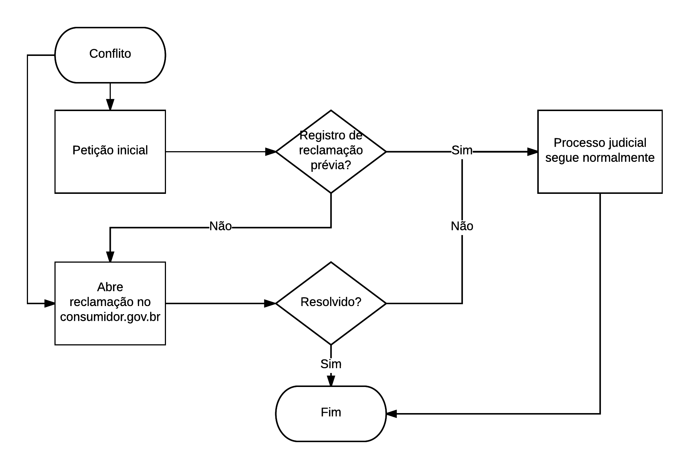

```{r}
knitr::opts_chunk$set(echo = F, eval = T)
```

# Sugestões para aprimoramento do sistema {#sugestoes-para-aprimoramento-do-sistema}

Nesse capítulo, apresentamos uma lista de recomendações com o objetivo de aprimorar a administração judiciária, posto que tais sugestões não se limitam apenas à justiça consumerista.

Ressaltamos que as recomendações apresentadas não integram uma única política pública articulada. A grande maioria pode ser implementada de maneira isolada, sem depender da implementação das demais.

Esclarecemos também que as medidas apresentadas nem sempre refletem sugestões efetivas de implementação por parte da ABJ e de seus associados. O propósito na elaboração da lista foi disponibilizar aos agentes de governo uma visão sobre diferentes soluções possíveis para o problema.

Primeiramente, apresentamos um resumo dos principais resultados obtidos na pesquisa. Os resultados foram organizados de acordo com os objetivos propostos na introdução.

Em seguida, apresentamos um total de 8 sugestões. A maioria das propostas são aplicáveis no plano técnico e não temos nenhuma proposta consolidada de mudança legislativa. Entendemos que tais recomendações são capazes de provocar uma reflexão aprofundada sobre o problema e propiciar um melhor entendimento a respeito das soluções que seriam mais adequadas à nossa realidade.

No final, apresentamos três sugestões de novas pesquisas. O intuito das sugestões é aprofundar os levantamentos realizados ou investigar outros temas importantes para o direito do consumidor.

## Resumo dos principais resultados da pesquisa.

**Os maiores litigantes em ações consumeristas na Justiça Estadual**. A Tabela \@ref(tab:resultAll) mostra os 5 maiores litigantes em cada Tribunal da pesquisa, acompanhados da estimativa da participação das empresas dentro do total de processos consumeristas de cada Tribunal. Bradesco é a única empresa que figura dentre os cinco maiores litigantes em todos os estados analisados. Outros bancos e empresas de telecomunicações também aparecem no topo dos maiores litigantes com frequência.

```{r tab:resultAll, results='asis'}
pega_n <- function(x, nn = 5) {
  nm <- deparse(substitute(x)) 
  nm <- nm %>% 
    stringr::str_match('_([a-z]+)$') %>% 
    magrittr::extract(TRUE, 2) %>% 
    toupper()
  head(x, nn) %>% mutate(tribunal = nm)
}
nn <- 30
# todos_maiores_nn <- list(
#   pega_n(maiores_litigantes_tjam, nn),
#   pega_n(maiores_litigantes_tjba, nn),
#   pega_n(maiores_litigantes_tjdft, nn),
#   pega_n(maiores_litigantes_tjmt, nn),
#   pega_n(maiores_litigantes_tjrj, nn),
#   pega_n(maiores_litigantes_tjrs, nn),
#   pega_n(maiores_litigantes_tjsp, nn)
# ) %>% 
#   bind_rows() %>% 
#   select(Tribunal = tribunal, everything())
# saveRDS(todos_maiores_nn, 'data-raw/todos_maiores_nn.rds')

todos_maiores_nn <- readRDS("data-raw/todos_maiores_nn.rds")
todos_maiores_nn %>% 
  group_by(Tribunal) %>% 
  slice(1:5) %>% 
  ungroup() %>% 
  knitr::knit_print(caption = "Maiores litigantes em ações consumeristas",
                    align = 'llrrrr')
```

A Figura \@ref(fig:acu) mostra a proporção acumulada de processos dos 30 maiores litigantes relativa à totalidade de processos consumeristas. O gráfico verifica a hipótese inicial da pesquisa de que os trinta maiores litigantes concentram pelo menos 50% dos processos. De fato, quatro dos sete tribunais analisados apresentam proporções acumuladas maiores que 70%, e cinco tribunais concentram aproximadamente 50% dos processos apenas com os 10 maiores litigantes. O tribunal com menor concentração dos maiores litigantes é o 

```{r fig:acu, fig.cap="Proporção acumulada de processos consumeristas dos 30 maiores litigantes em cada estado."}
p1 <- todos_maiores_nn %>% 
  group_by(Tribunal) %>% 
  mutate(pp = parse_number(p, locale = locale(decimal_mark = ',')) / 100,
         pp_acu = parse_number(p_acum, locale = locale(decimal_mark = ',')) / 100,
         id = 1:length(pp)) %>%
  ggplot(aes(x = id, y = pp_acu, colour = Tribunal)) +
  geom_line() +
  theme_minimal(16) +
  geom_hline(yintercept = 0.5, linetype = 2) +
  scale_y_continuous(labels = scales::percent, breaks = 0:10/10) +
  labs(x = 'Quantidade de empresas', y = 'Proporção acumulada')
p1
```

**Características dos litigantes e de seus litígios**. A Tabela \@ref(tab:setoresAll) mostra os três setores com maior concentração de casos em cada Tribunal. Em relação ao perfil dos litigantes, ficou clara a concentração do setor bancário e setor de telecomunicações. Em relação ao perfil dos litígios, observamos uma grande concentração de casos de dano moral e contratos, mas com significativas variações de acordo com setor e região.

```{r}
# nn <- 30
# todos_maiores_setores_nn <- list(
#   pega_n(maiores_setores_tjam, nn),
#   pega_n(maiores_setores_tjba, nn),
#   pega_n(maiores_setores_tjdft, nn),
#   pega_n(maiores_setores_tjmt, nn),
#   pega_n(maiores_setores_tjrj, nn),
#   pega_n(maiores_setores_tjrs, nn),
#   pega_n(maiores_setores_tjsp, nn)
# ) %>%
#   bind_rows() %>%
#   select(Tribunal = tribunal, everything())

todos_maiores_setores_nn <- readRDS("data-raw/todos_maiores_setores_nn.rds")
todos_maiores_setores_nn %>% 
  group_by(Tribunal) %>% 
  slice(1:3) %>% 
  ungroup() %>% 
  knitr::knit_print(caption = "Setores dos litigantes em ações consumeristas.",
                    align = 'llrrrr')

```


**De que forma os maiores litigantes variam regionalmente**. A partir da Tabela \@ref(tab:resultAll) e as tabelas completas de maiores litigantes nas respectivas Seções do capítulo de resultados, é interessante notar que os maiores litigantes mudam de perfil em cada região. No TJSP e no TJBA, os bancos Itaú e Bradesco aparecem antes das empresas de telecomunicação. No TJRJ e TJDFT, as empresas Oi, Vivo e Claro aparecem com destaque. No TJMT e no TJAM, além das empresas de telecomunicação e bancos, observamos empresas de energia ou seguros DPVAT. No TJRS, observamos um resultado diferenciado, por conta da presença de administradoras de cadastros de inadimplentes, como explicado na Seção de resultados. 

Os resultados indicam que existe uma relação entre os tipos de empresas que aparecem como maiores litigantes e o desenvolvimento econômico da região. Assim, áreas mais desenvolvidas tendem a concentrar mais casos envolvendo bancos e, enquanto áreas menos desenvolvidas tendem a concentrar casos envolvendo fornecedores de serviços essenciais. Para verificar essa hipótese de maneira aprofundada, sugerimos realizar estudos locais, como descrito na Seção \@ref(pesquisas-realizadas-localmente)

**Características dos meios alternativos ao litígio**. Nessa pesquisa, o principal meio alternativo ao litígio estudado teve como base os dados fornecidos em formato aberto pela Senacon, contendo informações detalhadas do sistema consumidor.gov.br. Os resultados são positivamente surpreendentes. Por exemplo, identificamos uma taxa de resolução de conflitos média de 76% na área de telecomunicações. Além disso, o tempo médio global de resolução de conflitos é de uma semana.

**Como as grandes empresas do setor privado veem o problema das ações consumeristas**. Com base nas entrevistas, pode-se afirmar que as empresas têm grandes preocupações com ações consumeristas e acreditam que buscar soluções alternativas ao litígio é a melhor forma de solucionar o problema. As empresas também apresentaram preocupações com relação a possível existência de advogados oportunistas e indústrias da gratuidade e do dano moral. No entanto, nenhum desses resultados foi testado empiricamente e continuam como hipóteses para futuras pesquisas.

**Soluções administrativas para lidar com os casos pendentes e reduzir a entrada de novos casos no judiciário**. A partir das reuniões realizadas no decorrer da pesquisa, acredita-se que aumentar incentivos ao acordo no judiciário não terá efeitos significativos sobre os casos já pendentes. No entanto isso não passa de uma hipótese e, por isso, sugerimos a realização de uma pesquisa aprofundada sobre a Semana da Conciliação na Seção \@ref(experimento-com-semana-da-conciliação) testar esse efeito. Para reduzir a entrada de novos casos, a solução principal foi proposta na próxima Seção. 

## Integração do judiciário com o consumidor.gov.br {#integracao-do-judiciario-com-o-consumidor.gov.br}

A presente solução é a mais importante da pesquisa. Além de ser a solução com maior impacto esperado para evitar novos processos, é tecnicamente viável, de baixo custo e seu impacto é mensurável.

As análises da base de dados do consumidor.gov.br revelaram que as reclamações pré processuais, além de rápidas são eficientes, com uma taxa de resolução de problemas de quase 80% na área de telecomunicações e de mais de 50% para problemas com bancos.

Nossa proposta para desafogar os tribunais e evitar novos pleitos é criar um fluxo para direcionar as demandas ao consumidor.gov.br antes de levar o problema a juízo. Seguindo esse trânsito, garantimos que houve uma tentativa de comunicação entre as partes através do consumidor.gov.br, sem gerar demandas adicionais ao judiciário e ao consumidor.

A Figura \@ref(fig:senacon) mostra o fluxo simplificado de como funciona a solução. Dado um conflito, o consumidor pode, entre outras alternativas, entrar com uma reclamação no consumidor.gov.br ou iniciar uma petição inicial eletrônica. No formulário de cadastro da petição inicial, será adicionado um campo para inserir o código identificador de reclamações prévias do mesmo tema no consumidor.gov.br. Se o autor da ação deixar esse campo em branco, uma reclamação é gerada paralelamente a fim de viabilizar uma tentativa de conciliação extrajudicial. Se o conflito for resolvido pelo consumidor.gov.br, o processo é encerrado. Em caso de o conflito não ser resolvido em um prazo fixo, a o procedimento no consumidor.gov.br é encerrado e o processo judicial corre normalmente.

{#senacon}

Essa solução possui as seguintes vantagens:

1. Obriga a empresa a atender o reclamante rapidamente.
1. Provavelmente não atrasa andamento o processo, visto que i) os procedimentos correm em paralelo, ii) o prazo de atendimento no consumidor.gov.br é curto e iii) os diálogos realizados através da plataforma auxiliam na tomada de decisão no processo judicial.
1. Evita a entrada de ações desnecessárias, ou seja, que podem ser resolvidas extrajudicialmente.
1. Desincentiva a entrada de litigantes e advogados oportunistas, uma vez que o consumidor.gov.br terá registro das discussões travadas entre reclamante e empresa.
1. Auxilia na documentação das reclamações, em razão do consumidor.gov.br possuir modelos de dados mais adequados para registrar informações sobre as queixas do que os sistemas dos tribunais.
1. Não afeta negativamente o acesso à justiça, já que o processo judicial é distribuído de qualquer forma.

Uma possível desvantagem da solução é que para alguns ela pode burocratizar a abertura do processo judicial. Por exemplo, se uma pessoa busca uma composição amigável via SAC ou ferramentas como o Reclame Aqui, ela repetirá o procedimento no consumidor.gov.br após entrar com uma ação. Ainda assim, considerando a velocidade de atendimento do canal, essa barreira tem impacto negativo negligenciável frente às vantagens obtidas.

A implementação não precisa ser feita em nível nacional em sua primeira versão. Inclusive, o ideal é que a solução seja implementada gradativamente e de forma planejada, garantindo i) o atendimento de um cronograma de implementação e ii) uma avaliação do impacto utilizando índices de atendimento da demanda.

Existem duas formas principais de aplicar a solução proposta de forma gradativa.

A primeira é selecionar algumas comarcas de interesse para adicionar o campo do formulário conectado com o consumidor.gov.br. A solução tem uma facilidade adicional, já que em casos consumeristas o endereço considerado pode ser o do autor do processo (Lei 8.078/1990, art.101, I). Dessa forma, selecionar uma comarca de interesse tende a representar o perfil dos autores do processo, ao invés dos réus.  

A segunda estratégia é iniciar os testes com alguns dos maiores litigantes identificados na pesquisa. O argumento para isso é que, como o volume de conflitos é muito grande, algumas empresas podem não estar preparadas para atender a demanda imediata.

O potencial dessa proposta para redução da litigiosidade é muito relevante, uma vez que afeta todos os peticionamentos eletrônicos. Essa também é uma forma adequada de aumentar a eficiência do judiciário, pois somente irão a juízo os casos que comprovadamente não forem resolvidos extrajudicialmente.

## Criação de ferramentas de monitoramento {#criacao-de-ferramentas-de-monitoramento}

A presente pesquisa auxiliou na identificação de eventos anômalos na litigiosidade. O maior exemplo disso foi o pico repentino na entrada de ações contra o Serasa no TJRS. Tais eventos podem acontecer de maneira localizada e nem sempre são perceptíveis nos grandes números.

No entanto, relatórios técnicos são ineficazes para identificar e controlar eventos anômalos dinamicamente. A solução adequada nesse caso é a criação de *dashboards* interativos e ferramentas de alerta. Idealmente, o CNJ e os Tribunais precisam ter uma ferramenta desse tipo nas Secretarias de Planejamento Estratégico (SEPLAN) e nas Corregedorias.

O Núcleo de Monitoramento de Perfis de Demandas da Corregedoria Geral da Justiça de São Paulo (NUMOPEDE) foi criado a partir do expediente CPA nº 2016/163905 e tem como objetivo monitorar demandas que, pelas suas características, impactam de forma substancial na organização dos serviços judiciais. A análise das demandas a partir do seu perfil pode se justificar, entre outros casos, por picos de distribuição em curto espaço de tempo, pelas características do litígio ou dos litigantes.

A proposta do grupo é racionalizar os trabalhos cartorários e coibir a utilização predatória da justiça. Para isso, monitoram a evolução de casos novos de forma contínua, segregando por i) classe e assunto; ii) comarca; iii) partes e advogados responsáveis. Dessa forma, é possível identificar picos temporais de distribuições de processos em determinadas localidades ou envolvendo empresas específicas, gerando alertas para agilizar na tomada de decisões estratégicas.

A sugestão para o CNJ sobre esse tema é entrar em contato com a equipe responsável pelo NUMOPEDE e definir passos para a implementação de uma ferramenta de visualização nacional para identificação de eventos anômalos. A ferramenta pode funcionar como uma aba adicional do recente módulo de produtividade mensal do CNJ.

## Metodologia de cálculo de volumes processuais por assunto {#metodologia-de-calculo-de-volumes-processuais-por-assunto}

Compreender o perfil das demandas é indispensável para a gestão eficiente dos Tribunais. Uma forma natural de identificar esses perfis é classificando os casos em tipos, que são grupos de processos com características comuns.

Atualmente, a forma mais direta de identificar tipos de processos judiciais é utilizando os chamados *assuntos processuais*. Os assuntos relacionam-se com as matérias discutidas em cada caso. Por exemplo, um caso cível de indenização por dano moral poderia ter um assunto "Indenização por dano moral", enquanto um processo falimentar de uma empresa em Recuperação Judicial poderia ser classificado como "Convolação de Recuperação Judicial em Falência".

Nesse contexto, um importante passo foi dado com a Resolução 46/2007 do CNJ[^cnjtpu2], que criou as TPUs. As TPUs são uma documentação oficial de todas as classes, assuntos e movimentações dos processos. As TPUs foram implantadas em todas as Justiças, o que facilita a realização de análises que comparam diferentes tribunais.

[^cnjtpu2]: http://www.cnj.jus.br/images/stories/docs_cnj/resolucao/rescnj_46.pdf. Acesso em 26/06/2017.

As TPUs são estruturadas em formato de árvore. Isso significa que temos assuntos genéricos e assuntos específicos, sendo que o assunto específico é um "filho" do assunto genérico. As TPUs podem ter até seis níveis hierárquicos de assuntos.

O problema enfrentado atualmente é que muitas vezes os processos são classificados com assuntos genéricos. Assim, ao contar todos os processos de determinado tema, podemos contar casos a menos por conta de problemas de classificação.

Subestimar do volume real de processos de um certo tipo configura a **cifra oculta**, que é dada pela quantidade de processos de um assunto classificados em assuntos genéricos.

A cifra oculta pode ser estimada usando técnicas estatísticas apropriadas. Para isso, no entanto, é necessário fazer algumas suposições ou utilizar conhecimentos de especialistas sobre o tema. No capítulo de metodologia apresentamos uma solução replicável para resolver o problema.

A solução apresentada depende de algumas suposições, mas poderia ser rapidamente implementada em sistemas e relatórios gerenciais. Um caso importante é o Módulo de Produtividade Mensal do CNJ, que poderia apresentar estimativas de volume processual para todos os assuntos.

## Utilização da métrica IADR para avaliação de impactos {#utilizacao-da-metrica-iadr-para-avaliacao-de-impactos-das-medidas}

Toda medida adotada para aprimoramento da administração judiciária precisa ser avaliada no plano prático, ainda que faça sentido teoricamente. Sem avaliação, não é possível aferir eficácia e, por conseguinte, é difícil propor melhorias.

Na metodologia também apresentamos uma métrica chamada IADR: Índice de Atendimento à Demanda Relativo, que pode ser visto como uma generalização da taxa de congestionamento e do Índice de Atendimento à Demanda (IAD) para estudar a litigiosidade de um tribunal.

A proposta nesse caso é utilizar o IADR para avaliar o impacto de mudanças. O peso relativo dos casos pendentes a ser utilizado no cálculo dependerá de decisões estratégicas e será objeto de futuras pesquisas.

Caso a primeira proposta dessa pesquisa seja implementada, seria possível calcular a evolução mensal do IADR em processos consumeristas. Nesse caso, a implementação gradativa em diferentes
comarcas/estados permitiria a comparação do IADR usando técnicas como *differences in differences* [@bertrand2004much], que resultam em estimativas razoáveis sobre os efeitos das políticas.

## Utilização de modelos de classificação de partes {#utilizacao-de-modelos-de-classificacao-de-partes}

Um dos maiores desafios metodológicos enfrentados durante a realização da presente pesquisa foi a limpeza e classificação das partes nos processos.

Parte das bases vieram com nomes de empresas acompanhados dos documentos (CPF ou CNPJ). Em tese, a tarefa de contagem a partir dos CNPJs seria trivial. No entanto, os diversos problemas de documentação presentes nessas bases nos forçaram a utilizar os nomes das empresas como base em todos os casos.

Classificar as empresas a partir dos nomes também não é trivial, pois os nomes podem aparecer de formas distintas. Em alguns casos, nem mesmo seres humanos são capazes de distinguir, por exemplo, se uma parte é pessoa jurídica ou física, olhando apenas para o nome.

No decorrer dos trabalhos, testamos vários modelos de classificação das partes. Os modelos partiram de expressões regulares e criação de *white lists*[^white], que foram se tornando mais sofisticados com a aplicação de
técnicas como regressão LASSO [@friedman2001elements] em *sacolas de palavras*[^bag]. No final,
acabamos considerando um conjunto de expressões regulares, pela
simplicidade e estabilidade dos resultados.

[^white]: Uma *white list* é uma lista de nomes que certamente ou quase certamente indicam como classificar o nome da parte. Essa lista inclui nomes de empresas conhecidas, como Bradesco, Itaú etc.

[^bag]: *Bag of words* ou sacola de palavras é uma maneira de organizar textos a partir da contagem de palavras em documentos. Uma característica importante da sacola de palavras é que ela não considera a ordem em que as palavras aparecem. Assim, por exemplo, Itaú Unibanco e Unibanco Itaú são equivalentes.

A grande vantagem do trabalho realizado é que a classificação é replicável. Isso significa que uma nova pesquisa na área de maiores litigantes poderia utilizar o mesmo código para realizar a classificação das empresas. Além disso, o código é aberto e pode ser testado e melhorado.

A solução final foi implementada num pacote escrito em R chamado `tidyML`[^tidyml]. Nossa sugestão nesse caso é que o pacote seja testado e melhorado com sugestões de outros pesquisadores. Dessa forma, será possível reclassificar os nomes de empresas em todos os Tribunais de maneira unificada, facilitando muito na realização de levantamentos futuros.

[^tidyml]: Acesso em https://github.com/abjur/tidyML. No momento de elaboração desse texto, o tidyML ainda não estava finalizado.

## Sistema de Classificação de Empresas e Incorporações {#sistema-de-classificacao-de-empresas-e-incorporacoes}

Para a realização desse projeto, foi necessário pesquisar o histórico das empresas e suas incorporações. Isso foi feito, dentre muitos outros casos, para o Itaú e Unibanco, que nos dias de hoje são parte da mesma corporação.

Um problema dessa tarefa é a necessidade de tomadas de decisão arbitrárias. Por exemplo, decidimos manter separadas as empresas Via Varejo e GPA, que até o momento desta redação eram controladas pelo grupo Casino.

Para o atendimento dos princípios da transparência e reprodutibilidade, é importante que uma tabela de-para oficial das empresas e suas incorporações seja disponibilizada publicamente. Essa tabela deve ser dinâmica pois as incorporações acontecem a todo momento.

Nossa sugestão é que o Sistema de Classificação de Empresas e Incorporações (SCEI) seja uma ferramenta similar às Tabelas Processuais Unificadas do CNJ. As empresas devem ser classificadas em formato de árvore, acompanhadas de seus códigos, que nesse caso serão os CNPJs. Especialistas cadastrados no SCEI poderiam propor mudanças nessa classificação ao longo do tempo.

Na ABJ sempre nos esforçamos para manter os códigos utilizados para realização das análises disponíveis. Caso a sugestão da tabela seja implementada, os códigos desenvolvidos para essa pesquisa podem auxiliar na criação da versão inicial das tabelas.

## Experimento com semana da conciliação {#experimento-com-semana-da-conciliacao}

O CNJ promove anualmente a Semana Nacional da Conciliação. Trata-se de uma campanha de mobilização na qual todos os Tribunais Brasileiros concentram seus esforços, durante uma semana, na obtenção do maior número possível de composições amigáveis.

Além de ser uma forma de reduzir o volume processual, a semana da conciliação é uma oportunidade muito interessante para conduzir experimentos. Tais experimentos poderiam ser utilizados para mensurar o efeito do incentivo à conciliação, buscando estabelecer os limites desse efeito.

Uma forma de conduzir o experimento é selecionando aleatoriamente processos elegíveis ou não na semana de conciliação. Dessa forma seria possível isolar o efeito do incentivo à conciliação, sem prejuízo ao curso natural do processo. Estudos recentes sugerem que é possível atingir o mesmo objetivo sem a aplicação completa de aleatorização: [@Fossaluza2015] discute o tema da alocação intencional na condução de experimentos. Com a técnica de alocação sequencial, é possível testar hipóteses com amostras menores.

Um resultado interessante desses experimentos é a possibilidade de testar a hipótese de que adicionar cláusulas para incentivar conciliação é efetivo. Em estudos observacionais, essa inferência causal não seria possível, pois o efeito estaria confundido [@pearl2009causality].

## API pública para extração de processos {#api-publica-para-extracao-de-processos}

Existem inúmeras ferramentas públicas e privadas para busca e recuperação de processos. Os sistemas são eficazes, mas são todos voltados para a busca de informações individuais. Se uma pessoa tiver o número identificador, ela achará informações do processo. Se precisar uma lista de processos, poderá utilizar ferramentas de busca.

Cientistas de dados, no entanto, precisam ter a possibilidade de exportar os dados completos ou algum recorte da população para planilhas. Existem muitos exemplos de páginas úteis para cientistas de dados, como IpeaData, Datasus, IBGE, entre outros.

Também é possível utilizar *Application Programming Interfaces* (APIs) para obter dados de *tweets*, publicações no Facebook, entre outros. O importante é notar que os sistemas voltados para análise de dados são em sua maioria voltados para extração de informações de muitos indivíduos. Os dados são organizados para análise e não para consulta individual. Muitas vezes é necessário limpar a base, mas isso faz parte do fluxo da ciência de dados [@wickham2016r].

Na área do direito, o pesquisador fica numa situação complicada, pois precisa
de dados da população ou de uma amostra, com linhas e colunas, numa planilha padronizada. No entanto, tudo o que consegue encontrar são documentos individuais, listagens de processos e arquivos em formato fechado, como o *Portable Document Format* (PDF).

Muitas vezes os dados estão disponíveis em páginas web mas é muito demorado buscar todos os casos que precisamos manualmente ou através de ofícios. Por isso, é usual construir *web scrapers*, que são robôs que baixam as páginas automaticamente e depois as tranformam em dados estruturados.

Atualmente, a utilização *web scrapers* é indispensável em estudo jurimétricos. As pesquisas realizadas pela ABJ foram fortemente influenciadas por essas ferramentas.

Contudo, são raros os profissionais que dominam esse conhecimento. A ABJ disponibiliza abertamente todo seu aparato técnico ^[Disponíveis nos links:https://github.com/abjur (códigos genéricos da ABJ), https://github.com/courtsbr (web scrapers), e https://github.com/decryptr (ferramentas para quebrar CAPTCHAs).], mas as ferramentas não são capazes de resolver todos os problemas. Além disso, os sistemas dos Tribunais colocam impedimentos técnicos de acesso, dificultando a execução de pesquisas que poderiam ser benéficas para os próprios Tribunais.

Há muitos exemplos em que simplesmente não é possível obter as informações que necessitamos. Em muitos casos a única forma de acessar os dados é a partir da Lei de Acesso à Informação. Apesar da LAI ser um grande avanço, utilizá-la para todas as demandas é ineficiente pois congestiona os setores administrativos e técnicos dos Tribunais.

A solução mais eficaz para o problema de acesso aos dados envolve modificar os sites dos Tribunais, permitindo extrações de dados e disponibilizar APIs que permitam o pesquisadores de buscar as informações públicas de maneira segura e organizada.

Essas ferramentas são simples de construir para entidades como os Tribunais, que geralmente têm equipes de Tecnologia da Informação de altíssima qualidade. A solução não causaria impactos negativos nos sistemas; pelo contrário: ao permitir que os dados sejam baixados de forma programática, é possível controlar o volume de dados transferido por unidade de tempo, evitando que os servidores fiquem sobrecarregados.

A ABJ tem atuado em campanhas de abertura de dados do judiciário, construindo ferramentas, organizando eventos, ministrando cursos e fazendo contatos políticos. A Associação se coloca disponível auxiliar na definição de modelos de dados e formas de utilização das APIs. Acreditamos que num futuro próximo o Brasil será referência mundial na abertura de dados do Judiciário.

## Sugestões de novas pesquisas {#sugestoes-de-novas-pesquisas}

É próprio e esperado da pesquisa apresentada que o levantamento de dados provoque novos questionamentos a respeito de problemas até então insuspeitos. Cada resposta traz consigo novas perguntas.

Ao elaborar os relatórios procuramos incluir algumas questões não diretamente ligadas ao problema da justiça consumerista, mas que intuíamos àquela altura estarem ligadas a outras questões sensíveis ao tema.

Os resultados apresentados, apesar de não serem conclusivos, são suficientemente significativos para que as autoridades responsáveis se preocupem em investigá-los com maior profundidade nas próximas pesquisas.

A recomendação final é, portanto, a realização de novas pesquisas sobre pontos importantes que afetam a administração do judiciário. Sem prejuízo de outras temáticas, os quatro tópicos abaixo nos pareceram importantes.

## Pesquisas realizadas localmente {#pesquisas-realizadas-localmente}

Reduzir a cobertura nacional da pesquisa, e aumentar a quantidade de observações dentro de cada região. Em todas as pesquisas empíricas no direito, fica claro que locais com diferentes estruturas administrativas e diferentes culturas influenciam muito nas características dos processos [@abj2015]. Uma alternativa para solucionar esse problema é realizar uma amostra aleatória de varas e estudá-las de forma aprofundada, buscando conhecer e controlar a variabilidade. No entanto, é difícil controlar essa variabilidade a nível nacional, pois cada visita às varas pode incorrer em custos e tempo dispendido. Por esse motivo, uma sugestão é a realização de pesquisas locais, voltadas ao estudo das unidades federativas. Pesquisas como essa ainda seriam custosas pelo elevado número de comarcas, mas produziriam resultados mais consistentes.

## Pesquisas envolvendo gratuidade judiciária {#pesquisas-envolvendo-gratuidade-judiciaria}

Como observamos na presente pesquisa, um dos processos mais recorrentes do direito do consumidor são os casos que envolvem danos morais. Esse assunto processual tem a intuição de estar associado a uma indústria. Isso poderia ser explicado pela suposição de que existem magistrados com tendência a favorecer o autor da ação, arbitrando valores de indenização altos a ponto de incentivar as pessoas a litigar.

Um tópico relevante nesse contexto é a gratuidade judiciária, que tem fundamento no princípio constitucional da inafastabilidade do poder judiciário (CF, art. 5º, XXXV). A gratuidade também se encontra guarida na oferta constitucional de assistência judiciária integral e gratuita àqueles que comprovarem insuficiência de recursos (CF, art. 5º, LXXIV).

O objetivo geral dessa pesquisa é comparar os perfis de processos com e sem o benefício da justiça gratuita.

As principais métricas de comparação inicialmente propostas foram listadas abaixo.

1. Tempo entre a distribuição e sentença ou arquivamento do processo.
1. Proporção de decisões favoráveis/parcialmente favoráveis.
1. Valor de indenização do processo e proporção de acordos.
1. Características socioeconômicas dos autores.

Esse estudo pode ser usado para testar se mudanças administrativas nas regras para concessão da gratuidade teriam efeito na litigiosidade. Essa pesquisa teria de lidar obrigatoriamente com o princípio do acesso à justiça, a fim de evitar que uma decisão de política pública seja tomada unicamente para favorecer a eficiência do judiciário.

## Relação entre desenvolvimento e litigiosidade {#relacao-entre-desenvolvimento-e-litigiosidade}

Em 2013 a ABJ organizou seu terceiro Seminário de Jurimetria, onde foi discutida a relação entre litigiosidade e desenvolvimento. Essa pesquisa teve como proposta alertar a sociedade de que a litigiosidade é positivamente associada ao crescimento da população e, por isso, poderíamos estar mensurando o efeito de ações para barrar a entrada massiva de novos casos de maneira ineficiente.

A litigiosidade pode ser definida como o número de casos novos por cem mil habitantes. Já o desenvolvimento pode ser representado por diversas variáveis, dentre elas o Índice de Desenvolvimento Humano (IDH). A Figura \@ref(fig:litig) mostra um gráfico de dispersão entre essas duas quantidades, baseando-se nos dados do PNUD (Programa das Nações Unidas para o Desenvolvimento) para o IDH em 2010 e o RJN para o número de casos novos por cem mil habitantes em 2015. A correlação observada nesse caso é de 77%.

{#fig:litig}

No entanto, sabemos que correlação não implica em causalidade. Existem várias explicações possíveis para essas duas variáveis estarem associadas. Assim, pode ser que um estado receba um incremento na sua renda per capita sem necessariamente aumentar a litigiosidade.

Nesse contexto, seria interessante realizar uma investigação mais aprofundada do problema, buscando aferir uma relação causal entre desenvolvimento e litigiosidade. Uma alternativa para isso seria ligar bases de dados de processos com bases de dados de trabalhadores, como a RAIS (Relação Anual de Informações Sociais). Dessa forma, seria possível investigar se choques positivos na renda das pessoas aumentariam a probabilidade de entrada na justiça.

Se verificada, a relação causal entre desenvolvimento e litigiosidade seria útil não só para predizer a demanda futura de processos, mas também a definir estratégias direcionadas para redução de litígios.

## 
